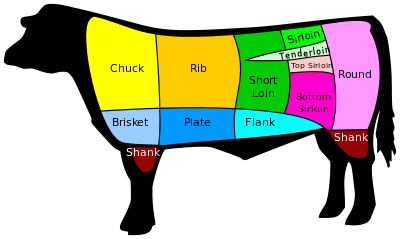

# ExCut aka CrossCut

<div align="center" style="margin-top:10px;">
  
</div>

[](https://hex.pm/packages/ex_cut)
[](https://hex.pm/packages/ex_cut)
[](https://semaphoreci.com/imhotep/ex_cut)


## Motivation

  ExCut defines an annotation construct that wraps a regular function and enable
  it to be decorated with a cross-cutting concern. This provide a clean mechanism
  to inject reusable behavior without cluttering your code base.

## Documentation

[ExCut](https://hexdocs.pm/ex_cut)

## Examples

[ExCut Examples](https://github.com/derailed/ex_cut/tree/master/examples)

## Installation

  Add the following dependencies to your Elixir project

  ```elixir
  def deps do
    [
      {:ex_cut , "~> 0.1.0"}
    ]
  end
  ```

## Using

  Let's take a look at ExCut in action to add logging behavior to a set of
  functions.

  ```elixir
  defmodule Logging do
    use ExCut, marker: :log, pre: :pre, post: :post

    require Logger

    @log level: :warn
    def elvis(a, b) when is_boolean(a), do: b

    @log level: :debug
    def elvis(a, b) when is_atom(a), do: "#{a}--#{b}"

    @log level: :info
    def elvis(a, b), do: a + b

    def pre(c)       , do: "> #{c.target}(#{c.args |> inspect})" |> log(c)
    def post(c, _, r), do: "< #{c.target} -> #{r}"               |> log(c)

    defp log(m, ctx) do
      ctx.meta[:level]
      |> case do
        :warn  -> m |> Logger.warn
        :debug -> m |> Logger.debug
        _      -> m |> Logger.info
      end
    end
  end
  ```

  ExCut provisions an `ExCut.Context` with call details and metadata
  that comes from the annotation. You can leverage this information in
  your cross-cutting functions.

---
 © 2017 Imhotep Software LLC.
All materials licensed under [Apache v2.0](http://www.apache.org/licenses/LICENSE-2.0)